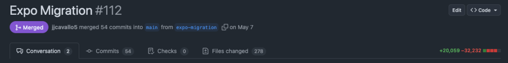
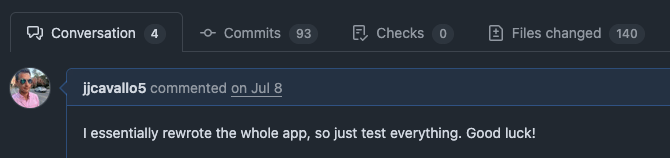
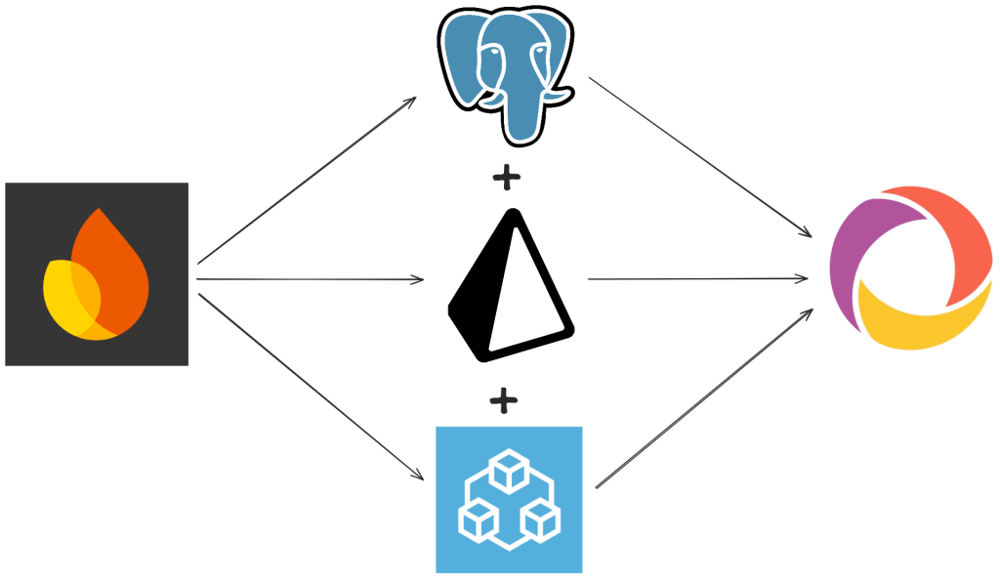

A little over a year ago, Hani (our CEO) came to me with an idea: he wanted to
built a software platform to connect homeowners and contractors. We had worked
together in college on a capstone project where we built an Android app, so he
knew I could write code. He had found an unfilled niche in the home industry:
even with the widespread adoption of online marketplaces and technology, most
contractors still rely on word-of-mouth to find prospective clients. His idea
was to build a platform to change that.

After some brainstorming and planning, in January of this year, I sat down and
started to build.

## "Initial Commit"

It all started with one command:

```bash
npx @react-native-community/cli init contractory
```

...looking back now, I was not off to a hot start.

And so, version 0 of Contractory was born, and let me say, it was an ugly baby.
For some reason, the warning signs didn't trigger in my head when I had to go
digging through the React Native website to find that command. I'd always used
the React Native CLI, so why would I complicate things by using this "Expo"
framework that they seemed to be pushing so hard? Why install all of these
unnecessary dependencies that are just going to bloat my app with unused
packages and libraries? Wait...did I really just spend an entire week clicking
through Apple Developer Connect menus just to get a push notification to come
through on my iOS-simulator train-wreck?

## Rewrite #1: Expo



I'd hate to be on the other side of that code review

I continued building like this for a few months. When I wanted to share what I'd
built with my (largely non-technical) co-founders, I had to teach them how to
pull the latest update from GitHub, run an `npm install`, then an
`npx react-native run-android`. Most of the time, that wouldn't work because of
some broken dependency or corrupted cache, and so I would have to get on a call
and send terminal commands through Microsoft Teams to get them up and running.
Not at all worth it for them to just check out my login flow.

At one point, once I had a good amount of work done, I decided "hey, wouldn't it
be cool if I could get this installed on my phone?" So I started digging through
the Apple Developer docs, trying to figure out how to make that work. This was
the last straw. I'd already spent quite some time digging through the Apple
website to set up push notifications and deep linking, and now I was spending
more time trying to figure out what hoops I had to jump through to just get my
app onto the device it was built for.

Luckily, I had recently stumbled across Theo Browne's YouTube channel. I watched
a video where he booted up an Expo project live on stream, his viewers scanned a
QR code, and instantly hundreds of stream viewers were running his app on their
devices. This blew my mind. Here I was, spending hours trying to get my app set
up to do just that, and Theo did it in less than 60 seconds.

So I dug deeper. I read through the Expo docs, and it finally clicked. Live
over-the-air updates, directly to user's devices. Managed builds. CI/CD
pipelines that would automatically deploy to both the Google Play and Apple App
stores. A suite of packages for every problem I could dream up. This is why
people use Expo. For a single developer trying to build a scalable platform
fast, it's not an option. Expo is the only way.

And so, I booted up my computer, made a new directory, and ran:

```bash
npx create-expo-app@latest contractory
```

Contractory version 1.0 was born

## Rewrite #2: React Query

Luckily, the migration to Expo was pretty quick. The codebase wasn't massive by
any means, so re-structuring the files to fit the Expo Router paradigm was
relatively straightforward. It took the better part of a weekend to get it all
sorted out, but once I did, the benefits were plentiful.

Suddenly, my co-founders didn't have to touch their terminals or deal with the
clunky Android simulator. They could scan a QR code, and bang, there it was. All
of the latest updates, right their on their phone, where they are meant to be.
For the company as a whole, this was probably the most important decision I
made. I could ship a feature and they could have it on their phones within
minutes. This meant that, instead of the app reflecting only my thoughts as the
developer, everyone could provide feedback and input ideas regularly.

But behind the scenes, I was struggling with scaling the codebase. I found
myself having to think through the same issues regarding data over and over.
Keeping the data in the database and what was shown in the app in sync was
becoming a nightmare as the data model became more complicated. Quite often, I
found myself writing code that looked something like:

```tsx
const SomeComponent = () => {
  const [value, setValue] = useState();
  useEffect(() => {
    const load = async () => {
      const someValue = await getData();
      setValue(someValue);
    };

    load();
  }, []);

  if (!value) return <ActivityIndicator />

  return (
    ...
  )
};
```

There are plenty of issues here, and dealing with all of them bloats the code
and becomes more of a headache. Every time I want to fetch data on a page load,
I essentially have to copy-paste this same code block and make some minor
tweaks. Not to mention, what if the user's connection is poor and the request
never comes through? Right now, they're stuck staring at a loading screen
indefinitely. There is no error handling. The loading state only indicates the
lack of a value, not if the request truly is still processing. And this is only
for a single value: what if I need to make more than one request? The code
quickly becomes a conditional branching nightmare.

Let's say the component want's to update the `value` string and save it to the
database. Now there's two sources of truth: the value stored in the state
variable and the value that was written to the database. If one changes, we're
stuck in this out-of-sync state until the user reloads the page.

Digging around again, I stumbled across TanStack, a collection of libraries
built by Tanner Linsley, one of the leading experts in the web development
industry. Specifically, TanStack Query (and it's React-specific implementation,
React Query) targets this idea of making data fetching a lot less painful. Using
React Query, the above code becomes much more maintainable:

```tsx
const SomeComponent = () => {
  const {
    data,
    isFetching,
    isError,
    error,
    refetch
  } = useQuery({
    queryKey: ['query-key'],
    queryFn: getData,
    staleTime: 0, // Refetch instantly
    enabled: true, // Enable/disable query
  })

  if (isFetching) return <ActivityIndicator />
  if (isError) return <ErrorText>{error}</ErrorText>

  return (
    ...
  )
}
```

With less code, this improved version handles every edge-case of data fetching.
Did we hit an error? Okay, show an error message to the user. Are we still
fetching the data? Show a loading spinner. Conditional fetching? React query
handles it. Caching? Done. It's a drop-in data fetching solution that changed
the way I interacted with the data flowing through Contractory.

The migration here was a bit more painstaking than the original Expo re-write.
Not only was the app significantly larger at this point, with custom hooks and
data fetching components littering the codebase, but it also required much more
careful attention. Since the flow of data is in essence the app itself, nearly
all of the logic was ripped out and replaced. It was a temporary step backward,
but what came out the other side was a much more scalable and well designed
piece of software, even if it looked the same as before these changes.

Enjoy this comment on the pull request asking my co-founders to test the
changes:



## Rewrite #3: Convex

As the app continued to grow, there were additional pains that started to pop
up. Specifically, shortcuts I took with database design early on were starting
to catch up with me. As it turns out, shoving every piece of data that may
relate to a task in a "tasks" document in Firebase doesn't scale well. As more
and more data started flowing, my data model started to crumble. The "task"
object had 5 or 6 elements that were always defined, and then tens of other
elements that were all optional. Here is my Zod schema for validating the data
coming down from Firebase:

```typescript
export const BaseTaskSchema = z.object({
  displayName: z.string(),
  taskId: z.string(),
  clientId: z.string(),
  contractorId: z.string().optional(),
  clientPfpUrl: z.string().optional(),
  contractorPfpUrl: z.string().optional(),
  location: LocationSchema,
  description: z.string(),
  notes: z.string().optional(),
  status: TaskStatusSchema,
  postedDate: z.number(),
  updatedAt: z.number(),
  completionDate: z.number().optional(),
  startDate: z.number().optional(),
  acceptedQuote: QuoteSchema.optional(),
  officialContractUrl: z.string().optional(),
  attachments: z.array(FileSchema).optional(),
  productRequests: z.array(ProductSchema).optional(),
  workItems: z.array(WorkItemSchema).optional(),
  quotes: z.array(z.string()).optional(),
  contractorRequestedDates: z.array(z.number()).optional(),
  paymentIntentId: z.string().optional(),
  completionNotes: z.string().optional(),
  finalWalkthroughAttachments: z
    .array(FinalWalkthroughAttachmentsSchema)
    .optional(),
  finalWalkthroughSubmittedAt: z.number().optional(),
  paidOut: z.number(),
  issueReport: IssueReportSchema.optional(),
});
```

Again, so many issues that came from deferring a problem until everything came
crashing down. Every task-related piece of data from every task status state is
stored in one object. Imagine trying to build a component around this object: to
stop TypeScript from throwing a fit, you need to have branches on branches. Not
fun. It quickly became apparent that a data model rework was needed: the entire
app was faltering atop a house of cards.

What's the best way to solve this? Relationships. There's a reason SQL databases
have been the industry standard for years: they are excellent at modeling
complex data relationships, with interconnected and interwoven data. Using
different tables and relying on foreign keys separates out highly related pieces
of data, keeps the object size down, and keeps nullable fields to a minimum. The
best way to strengthen the foundation of the app was to rebuild it from the
ground up, starting with a strong, relational foundation.

While contemplating this rework, there was another thought floating around in my
head as well. It was around the time of the
[Tea data leak](https://www.teaforwomen.com/cyberincident?ref=blog.jeremycavallo.com),
which was caused by loose safety rules on a Firebase storage bucket. Like any
naive app developer, I had started building apps on Firebase, so I had initially
chosen it for Contractory as well. Thus, the news of a new app having a security
incident of that scale had me second-guessing our database provider.

And so the database migration began. Firebase just wasn't built for what I
needed, and the difficulty of properly configuring the security wasn't worth the
risk.



I explored a few options. The first was the tried and true: PostgreSQL. It's
been around for ages, and companies are still choosing it today, so it must do
something right. In a search for end-to-end type safety and a distaste for
manually writing SQL queries, I also landed on tRPC and Prisma, which play very
nicely with Postgres. I spent about a day getting everything wired up and
re-implementing the task posting feature in the app, just to get a feel for how
things worked. I thoroughly enjoyed the workflow, and the end-to-end type safety
felt like magic.

However, when going into this migration, I made a promise to pick the best
solution, not just the first one. I knew about Convex, again from Theo, so I
spent the next day going back to square one and re-writing the task posting
feature again. But it didn't take a day. It took a good 3 hours, including
setting up the project on their dashboard. It was...painless. Everything just
worked, exactly how I expected it to, with an added benefit: my data syncing
issues were resolved. Convex opens a web socket directly to your app, meaning if
data updates in the database, it gets pushed down to the client: no reload
needed. That meant all of the syncing code floating around could simply be
deleted.

But what about relationships: isn't Convex just another document store? Yes and
no. Out of the box, Convex can be used as a document store, but that is clearly
not why I chose them. They have a relational model built on top of their
document storage that supports schema definitions (written in TypeScript!) and
relationships between tables. Also, defining a schema tells Convex the shape of
your data, providing end-to-end type safety.

Even though I did enjoy working on Postgres, Prisma, and tRPC, Convex was the
clear choice. Since switching, I've been able to move at light-speed. As we move
toward launch, we've been focusing on getting feedback from prospective users,
so moving fast to iterate on that feedback is essential.

## What's next?

Right now, we've landed on technology that fits our current needs. However, our
current needs are not representative of what they will be a month from now at
launch, and those needs will not be representative of our needs as we scale and
grow to thousands or millions of users. The only guarantee is that there will be
more changes in the future, and I'm excited to tackle those as they arise.

Keep an eye out: Contractory will be available soon!
