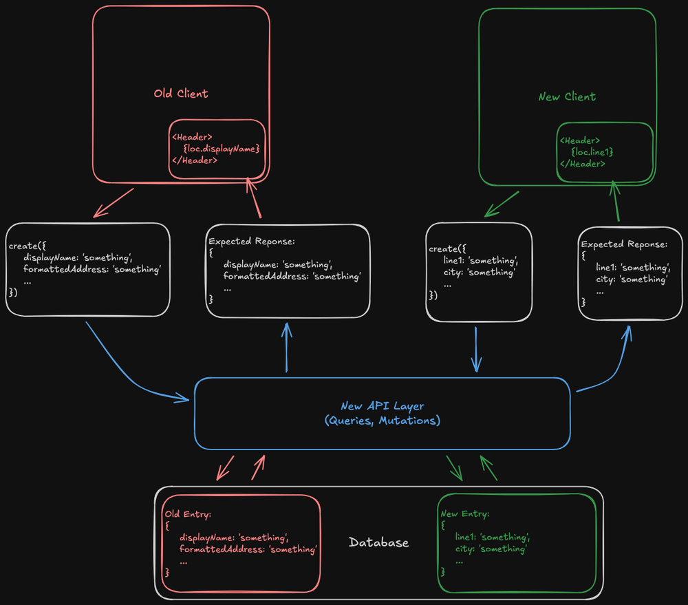

A few months ago, my company ([Contractory](https://contractory-app.com) - go
check them out!) made the switch to Convex. A few weeks ago, we celebrated our
official launch to the Apple App Store and the Google Play Store. Now that we
have real users and real data flowing, development requires an extra layer of
thought before hitting the "deploy" button.

Before users, development moves fast and database migrations are easy - just
drop the database and start from scratch. However, as soon as you have your
first user, that option goes away and you have to be more clever about how you
update your data model. Developing for mobile brings in a new set of problems;
with the app store approval process, clients can be on old (like ... really old)
versions of your app. The new data model needs to be backward-compatible and
support these old versions.

Here's an overview of some of the questions you need to think about before
pulling the trigger on a database schema change:

- What exact fields am I changing, adding, or removing in my new schema?
- How do I convert an old database entry to match the new schema?
- When I query data, how do I make sure that new data works on new clients and
  old clients?

Before continuing, be sure to check out the Convex
[Intro to Migrations](https://stack.convex.dev/intro-to-migrations?ref=blog.jeremycavallo.com)
guide. The rest of this post is a practical example of the high-level ideas
outlined there.

## Understanding the Current Data Model

The first step to any data migration is gathering a full understanding of what
data you are working with, what modifying that data looks like, and how that
data is used by the client.

Lets look at my location example. Here is the existing schema:

```typescript
location: defineTable({
  latitude: v.number(),
  longitude: v.number(),
  geohash: v.string(),
  displayName: v.string(),
  formattedAddress: v.string(),
  placeId: v.optional(v.string()),
});
```

On the client, I have a component that renders the location:

```tsx
const LocationDisplay = ({ location }: { location: Doc<"location"> }) => {
  const withoutCountry = location.formattedAddress.split(",").slice(0, -1);

  return (
    <View>
      <Header>{location.displayName}</Header>
      <Text>{withoutCountry}</Text>
    </View>
  );
};
```

And I also have mutation functions for creating and updating location entries:

```typescript
export const create = mutation({
  args: {
    latitude: v.number(),
    longitude: v.number(),
    geohash: v.string(),
    displayName: v.string(),
    formattedAddress: v.string(),
    placeId: v.optional(v.string()),
  },
  handler: async (ctx, args) => {
    await checkAuth(ctx);
    return ctx.db.insert("location", args);
  },
});

export const update = mutation({
  args: {
    id: v.id("location"),
    latitude: v.optional(v.number()),
    longitude: v.optional(v.number()),
    placeId: v.optional(v.string()),
    geohash: v.optional(v.string()),
    displayName: v.optional(v.string()),
    formattedAddress: v.optional(v.string()),
  },
  handler: async (ctx, args) => {
    await checkAuth(ctx);
    const { id, ...withoutId } = args;
    return ctx.db.patch(id, withoutId);
  },
});
```

Sorry, lots of code. But here are the important parts:

- My UI expects the `formattedAddress` and `displayName` fields to exist.
- The geohash field is unused in my application code, and thus is unproblematic.
- The create/update mutation functions take in the schema fields as parameters
- The LocationDisplay component isn't very robust to different address formats
  (hence the reason for this migration)

## Understanding the New Data Model

Now that you have explored the existing model and how the data flows through
your system, it's time to look at the new model. It's important to understand
the reason behind the migration, as well as all of the surfaces that will be
touched by the migration.

For my location example, the reason was simple: I didn't have enough granularity
in my data fields. If I wanted to only display the city and state of an address,
I had to do some unsafe string parsing that could result in key errors or
unexpected results. Thus, I needed to change the way I was saving out location
data. I want my location schema to look something like this in the future:

```typescript
location: defineTable({
  // Old Fields
  latitude: v.number(),
  longitude: v.number(),
  placeId: v.optional(v.string()),

  // New Fields
  line1: v.string(), // Street number + road name
  city: v.string(),
  state: v.string(),
  country: v.string(),
  postalCode: v.number(),

  // Deleted Fields
  // displayName
  // formattedAddress
  // geohash
});
```

## The Migration Path

If Contractory had 0 users and 0 downloads, this migration would be easy: drop
the entire location table, push the new schema, update the mutation functions to
take the new fields, and update the UI component to handle the new fields.
Previously in Contractory's development, this is what I have done. That approach
is no longer valid; we have real users and real data, so dropping an entire
database table isn't an option. Making a new table could work, but other
database objects reference locations. This would vastly increase the surface
area of the migration, which simultaneously increases the surface area for
errors.

So what do we do? The idea: take the existing schema, expand it to optionally
include the new fields, expand our mutation functions in the same way, and
expand the query function to return the data required by both old and new
clients. Also, we can back-fill old table entries with the new fields, so that
when we eventually remove the migration code, those entries are handled
gracefully.

This puts a lot of responsibility on our new API layer, and as such that's where
the majority of the migration code will live. It needs to handle mutations from
old and new clients gracefully, and it needs to make sure both old and new
clients get the fields they require. Here is a visualization of the migrated
system:



## The Migration Implementation

WARNING: This section is going to be dense. Proceed with caution.

Now that we have a high-level plan, what does it look like to implement it?
Let's start by expanding our schema and mutation functions. To do this, every
field that is changing (either being added or deleted) should be marked as
optional:

```typescript
location: defineTable({
  // Old Fields (to keep)
  latitude: v.number(),
  longitude: v.number(),
  placeId: v.optional(v.string()),

  // New Fields
  line1: v.optional(v.string()),
  city: v.optional(v.string()),
  state: v.optional(v.string()),
  country: v.optional(v.string()),
  postalCode: v.optional(v.string()),

  // Old Fields (to remove)
  geohash: v.optional(v.string()),
  displayName: v.optional(v.string()),
  formattedAddress: v.optional(v.string()),
});
```

And the mutation functions:

```typescript
export const create = mutation({
  args: {
    // Old Fields
    latitude: v.number(),
    longitude: v.number(),
    placeId: v.optional(v.string()),
    geohash: v.optional(v.string()),
    displayName: v.optional(v.string()),
    formattedAddress: v.optional(v.string()),

    // New Fields
    line1: v.optional(v.string()),
    city: v.optional(v.string()),
    state: v.optional(v.string()),
    country: v.optional(v.string()),
    postalCode: v.optional(v.string()),
  },
  handler: async (ctx, args) => {
    // ...
  },
});

export const update = mutation({
  args: {
    // Old Fields
    id: v.id("location"),
    latitude: v.optional(v.number()),
    longitude: v.optional(v.number()),
    placeId: v.optional(v.string()),
    geohash: v.optional(v.string()),
    displayName: v.optional(v.string()),
    formattedAddress: v.optional(v.string()),

    // New Fields
    line1: v.optional(v.string()),
    city: v.optional(v.string()),
    state: v.optional(v.string()),
    country: v.optional(v.string()),
    postalCode: v.optional(v.string()),
  },
  handler: async (ctx, args) => {
    // ...
  },
});
```

Now, after this migration goes live, ideally I don't want to write any more old
records to the database, even if there are still old clients trying to write old
records. Thus, we need a mapping function that converts old records to new
records. In my case, I'm doing some string parsing to recover the `line1`,
`city`, `state`, `postalCode`, and `country` fields from the formatted address.
In the code below, this happens in the deformatAddress function.

Now, our mutation function implementations need to expand to support both types
of requests:

```typescript
export const create = mutation({
  args: {
    // (See Above)
  },
  handler: async (ctx, args) => {
    await checkAuth(ctx)

    if (args.formattedAddress) {
      // This request came from an old client
      const {
        line1,
        city,
        state,
        postalCode,
        country
      } = deformatAddress(args.formattedAddress)
      return ctx.db.insert('location', {
        ...args,
        line1,
        city,
        state,
        postalCode,
        country
      })
    }
  } else {
    // This request came from a new client
    return ctx.db.insert('location', args)
  }
})

// Update function follows the same pattern
```

Nice. Now we can be sure than every new entry in our database has the expected
new fields. However, there are still issues we need to address.

First things first, let's update our UI component to use the new data rather
than the old `formattedAddress` and `displayName` fields, now that we aren't
storing those for our new entries:

```tsx
const LocationDisplay = ({location}: {location: Doc<'location'>}) => {
  return (
    <View>
      <Header>{location.line1}</Header>
      <Text>{`${location.city}, ${location.state}`</Text>
    </View>
  )
}
```

Now that we've handled data mutations from both old and new clients, and
normalized the way we are storing locations in the database between them, we
need a way of delivering these to the clients. Remember, our old client requires
a `formattedAddress` and `displayName` field, and our new client requires a
`line1`, `city`, and `state` field, otherwise the app will crash. Thus, our
query function needs to return all fields, no matter what type of data (old or
new) lives in the database. This means we need some new data mapping functions:

- A function that takes an old entry and recovers the new fields
  - `deformatAddress()` already does this for us!
- A function that takes new data and recovers old fields
  - In practice, I'm just using `displayName = line1` and `formattedAddress` is
    just a string combination of `line1`, `city`, `state`, and `country`.
  - Let's name this function `formatAddress()`

Now, in my location query, I can make sure all fields are returned properly:

```typescript
export const get = query({
  args: {
    locationId: Id<"location">,
  },
  handler: async (ctx, args) => {
    await checkAuth(ctx);
    const loc = await ctx.db.get(args.locationId);
    if (!loc) throw Error("Document not found");

    if (loc.formattedAddress) {
      // Old Entry
      // deformatAddress returns {line1, city, state, postalCode, country}
      return { ...loc, ...deformatAddress(loc) };
    } else {
      // New Entry
      // formatAddress returns {formattedAddress, displayName}
      return { ...loc, ...formatAddress(loc) };
    }
  },
});
```

Success! The API layer is now ready to handle requests from old and new clients,
and normalizes data going into the database.

## Future-Proofing

Eventually, when it is safe to do so and all clients have updated to the new
version, you'll want to remove the code that supports the old location format.
Doing so allows you to tighten the location schema and mark the new fields as
"required" rather than leaving them as optional. However, in the current state,
we still have old entries living in our database that are not normalized to
contain the new fields. Thus, when you try to update your schema, Convex will
throw an error saying that there are invalid entries in your table.

This is where the idea of back-filling comes in. We need a way of updating our
old entries to the new schema format. Luckily, we already have most of the tools
in place to do this: it's just a matter of looping over the entries, finding the
old ones, and updating them. It will look something like:

```typescript
export const backfill = internalMutation({
  handler: async (ctx) => {
    const locations = await ctx.db.query("location").collect();

    for (const location of locations) {
      if (location.formattedAddress && !location.line1) {
        // Old location, needs updating
        await ctx.db.patch(location.id, {
          ...location,
          ...deformatAddress(location),
        });
      }
    }
  },
});
```

Note that in practice, you probably want to paginate the query and batch the
updates to avoid loading the entire table into memory. I didn't do that here to
keep things simple.

And that's it! You can now start using the new fields in your application
without worry, and when the time comes, you can clean up the migration code.
