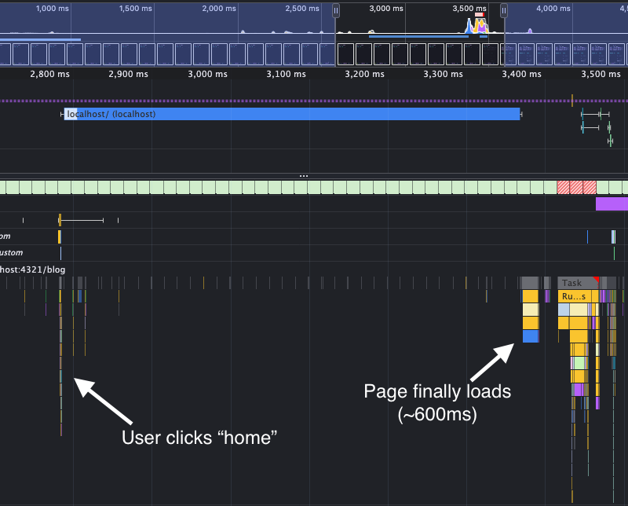

A few months ago, I started writing blogs. I always hated writing when I was in school, but now
I have a lot of thoughts about technology that I need to get out of my head and write them down somewhere.
I think it'll be interesting to look back and see what I was thinking about in the future.

A few months back, I started writing blogs on a service called [Ghost](https://ghost.org/). They're great, but also,
I don't feel like spending money on a blog. I think I'm good enough a programmer to build it
myself, and so today, I sat down and started to do just that.

## What is Astro?

Astro is a web framework specifically built for building statically hosted websites - perfect
for a blog. In fact, the initial tutorial in their documentation is all about building a personal
blog website, so I didn't have to dig very deep to get started!

Modern frameworks like [NextJS](https://nextjs.org), [Tanstack Start](https://tanstack.com/start/latest), [Svelte](https://svelte.dev/),
and many others are mostly focused on building web applications. These are perfect for highly-complex
sites, such as my company [Contractory](https://contractory-app.com). However, these frameworks are notorious
for slowing down the browser by loading a _lot_ of JavaScript.

Astro is built for the complete other side of the spectrum. It minimizes the amount of JavaScript sent
down to the client and renders the HTML markup on the server first, making the website incredibly
lightweight, responsive, and SEO-friendly. It even allows me to install by beloved React and render
React-based components directly from `.astro` files as "client islands"!

It all comes down to the classic debate of "where should I render?" Frameworks like React generally
sit in the single-page app (SPA) group, where the JS is sent down to the browser, and the browser
handles things on the client. Astro sits on the complete other side of the spectrum and focuses on
multi-page apps (MPAs), keeping the rendering on the server and sending down the markup.

## The Hard Parts

One thing I struggled with while creating the website that hosts this blog is building the mental model
for where code runs. In React, I'm used to being able to not have to think about these things - React
usually just runs in the browser no matter what (of course, until you start using full-stack frameworks 
like NextJS, but even then you have to declare where code runs with their 'use client' and 'use server' 
directives). With Astro, there was a learning curve to figuring out where things run.

I ran into this while rendering a React Client Island in my
code. On this site, the terminal input is a React Island. When I was building the blog list, I
wanted to register the command shortcuts (like the `b0`) with the terminal component. In my first
attempt, my thought was to just pass a key-value pair to the input, where the key was the command,
and the value was the function to run when that command was called:

```tsx
// blog-list.astro
<TerminalInput
  commands={[
    ...
    {'b0': () => navigate('/blog/learning-astro')}
    ...
  ]}
/>
```

However, this causes an issue: even though I'm passing the function through to the `TerminalInput`
component, it isn't as simple as just calling the passed function from that component. That's
because the `blog-list.astro` file is rendered on the _server_, and thus, the function stub
exists only on the server. Since functions aren't JSON serializable, they can't be passed directly
from the server to the client, so the function came through as undefined.

The fix for this was simple - just pass the route stub instead of the function itself. But
this is just an example of how Astro differs from what I'm used to with pure React.

## Where Astro Struggles

In 2026, creating a strictly static website is rare. There are usually things you need to
do outside of HTML and CSS to engage users and craft a pleasant user experience, even if
the content itself is mostly static. 

With Astro, things break down quickly when you want to start doing anything beyond rendering
HTML. As soon as TypeScript is involved, Astro loses it's magic. Data fetching happens on the
server and is blocking, meaning any _page_ that fetches data (yes, the whole page, even if the
fetch is in a child component) doesn't get sent down until that fetch resolves. Look at the
performance tab when I load the home page, which has to fetch my contributions from GitHub, recent
blog posts, and projects:



After the navigation request is first sent, the user has to wait ~600ms for the page to finally
load. That is an eternity!

Now of course, there is a way around this (which I implemented after finding this issue), but
it's not very pretty. It requires a third-party adapter for your hosting provider (Netlify, Vercel,
Cloudflare, or  Node), a `server:defer` prop passed to the blocking component, and if you don't
want that attrocious pop-in, you need to handle the loading state in the component. This is done
through another magic prop in the child, where you have to tag fallback elements with a
`slot="fallback"` prop. Overall a lot of magic syntax and clunky APIs that aren't very scalable
compared to the elegance of React's new async model.

