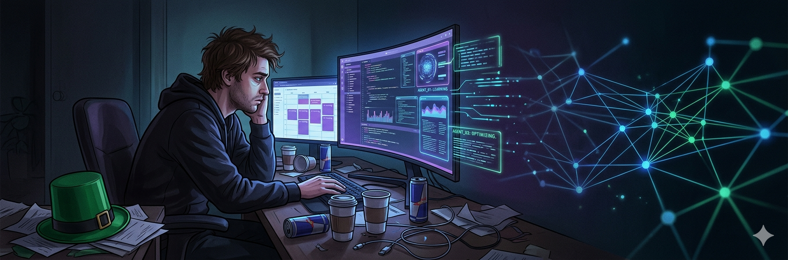
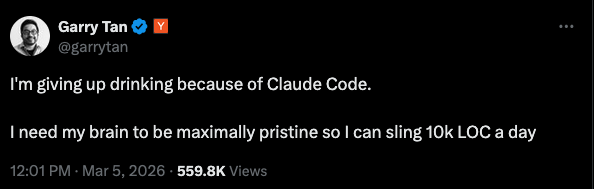
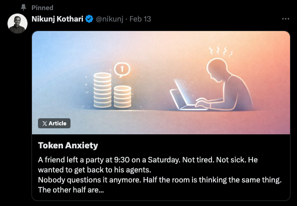
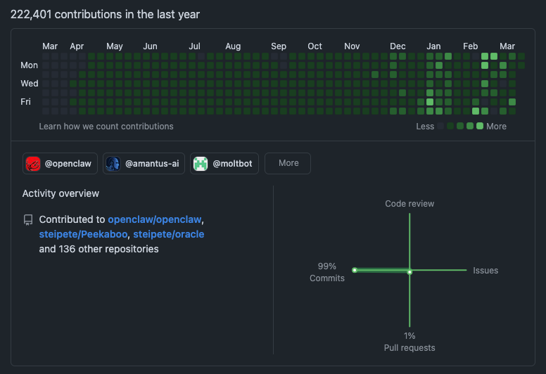

Saint Patty's day has always been an excuse to go out, drink, and let loose.
Tuesday night? Sure, why not. We'll call in sick on Wednesday, or just suffer
through. Right?

This year, at least for myself and a city-full of others, things feel a little
bit different.

Ever since programming really "took over" my life after college, I've noticed
something about myself. No matter what I'm doing, I'm _always_ trying to
optimize. I'm not even talking about code: I'm talking about walking to the
kitchen. I have thoughts like "if I'm in the kitchen to do X, I should do Y too
to save a trip", like the 4 second walk from the kitchen back to my desk is the
difference between life and death. It's what I'm programmed to do: find
inefficiency and optimize it away.

This really is a blessing in disguise. It's because of this that I can manage
working full time, running a company, and running 90 miles a week training for
the Boston Marathon. Most people would crack: somehow I've optimized my life
enough to make it sustainable.

But in the past week, I've seen a few things that have made me realize I'm not
alone in this "optimize everything" mindset, and to be honest, it's scary where
this is heading in the era of AI.

The thing about agents is that they supercharge human output. And for us seeking
the absolute limits of productivity, we've become slaves to the tokens. There's
always this nagging thought, deep down, thinking "what could I be running right
now". This nagging feeling seems to be sweeping across the Bay Area:

(You should go read
[Nikunj's post](https://writing.nikunjk.com/p/token-anxiety))

The issue is that we can't turn it off. For me, I always had that "what could I
be doing right now" feeling before AI, but I was limited by my "being human".
It's impossible to output Garry Tan's 10k-LOC/day as a mere human being because
we're limited by our brain's need for other things. Food, sleep, emotional
connection, all the things that make us _human_. But the agents? They can fly as
long as they have an unchecked box.

The issue is that someone has to tell them what to do next.

That's where the so-called "token anxiety" comes in: we can't take a break and
let loose, because what if Claude finishes it's session? Who's going to kick off
the next one? And it's not just a problem on St. Patty's day: it's an every-day
battle between logging off and kicking off "one more agent" before you go to bed
so that you can fully optimize the time you spend sleeping.

No matter what, it feels like we're all falling behind. We look at people like
Peter Steinberger, shipping 220 **thousand** contributions, and feel like our
measly 2000 will never suffice.

Every week, there's a new company getting acquired for a billion dollars, a new
model that will make our agents more robust, and a new method for maximizing
their productivity. It's impossible to keep up.

This year, St. Patty's day in SF will feel very different. Less noise in the
streets. Less people letting loose. We must keep the agents busy and optimize,
or we'll get left behind. This year, we drown ourselves in tokens, not green
beer.

      _Disclaimer: I don't live in San Fransico. Heck, I've never even
been. But "St. Pattys in Detroit" just doesn't have the same ring to it_
